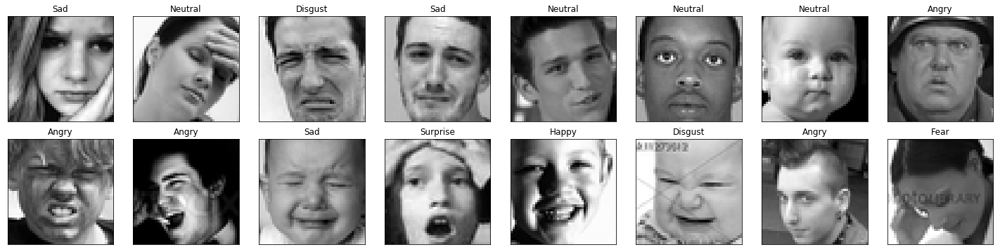
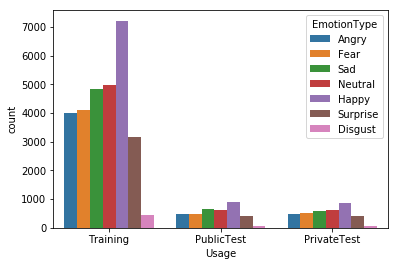

# Facial Expression Prediction

The goal is design an image processing algorithm that can determine the type of the facial expressions that is displayed in an image. The code is based on PyTorch.

# Overview

The data consists of 48x48 pixel grayscale images of faces. The faces have been automatically registered so that the face is more or less centered and occupies about the same amount of space in each image. The task is to categorize each face based on the emotion shown in the facial expression in to one of seven categories (0=Angry, 1=Disgust, 2=Fear, 3=Happy, 4=Sad, 5=Surprise, 6=Neutral).

train.csv contains two columns, "emotion" and "pixels". The "emotion" column contains a numeric code ranging from 0 to 6, inclusive, for the emotion that is present in the image. The "pixels" column contains a string surrounded in quotes for each image. The contents of this string a space-separated pixel values in row major order. test.csv contains only the "pixels" column and your task is to predict the emotion column.

The training set consists of 28,709 examples.


## Contents
  - [1. Setup Instructions and Dependencies](#1-Setup-Instructions-and-Dependencies)
  - [2. Dataset](#2-Dataset)
  - [3. Training the model](#3-Training-the-model)
  - [4. Repository overview](#4-Repository-overview)


## 1. Setup Instructions and Dependencies

Clone the repositiory on your local machine.

``` Batchfile
git clone https://github.com/ishanrai05/facial-expression-recognition
```

Start a virtual environment using python3
``` Batchfile
virtualenv env
```


Install the dependencies
``` Batchfile
pip install -r requirements.txt
```

You can also use google collab notebook. In that case just upload the notebook provided in the repository and you are good to go.

## 2. Dataset

The dataset is available to download from the kaggle [here](https://www.kaggle.com/c/challenges-in-representation-learning-facial-expression-recognition-challenge/data).

#### Sample



#### Data Distribution




## 3. Training the model

To train the model, run

```Batchfile
python main.py --train=True
```

optional arguments:
  | argument | default | desciption|
  | --- | --- | --- |
  | -h, --help | | show help message and exit |
  | --use_cuda | False | device to train on. default is CPU |
  | --samples | False | See sample images |
  | --view_data_counts | False | Visualize data distribution |
  | --model | densenet | resnet,vgg,densenet,inception |
  | --num_epochs | 10 | Number of epochs to train on |
  | --train | True | train the model |


## 4. Repository overview

This repository contains the following files and folders

1. **notebook**: This folder contains the jupyter notebook for code.

2. **resources**: Contains images.

3. `dataset.py`: pytorch code to load the dataset.

4. `models.py`: code for models.

5. `get_data.py`: code to read images.

6. `visualize.py`: code for visualizations.

7. `utils.py`: Contains helper functions.

8. `train.py`: function to train models from scratch.

9. `main.py`: contains main code to run the model.

10. `requirements.txt`: Lists dependencies for easy setup in virtual environments.

